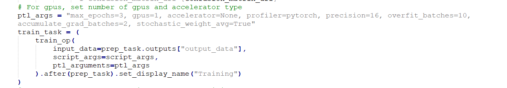
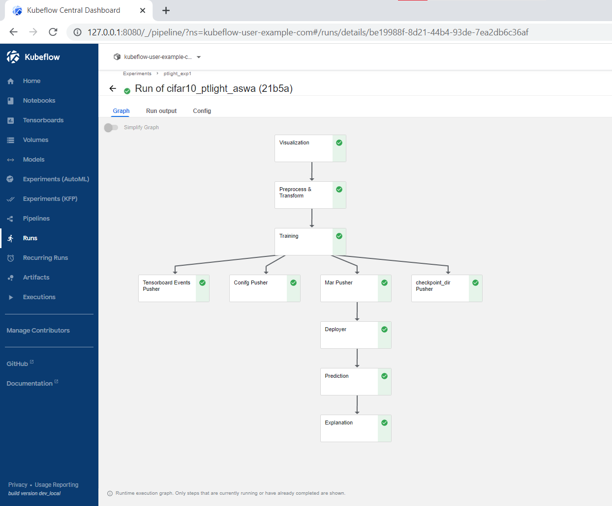

# Session 8 - PyTorch Lightning

The Assignment requires us to add atleast 4 new Lightning features to the existing deployment.

## The features added:
- gpus = 1 : Using GPUs   
- max_epochs = 3 : Run Training and Validation for 3 epochs 
- accumulate_grad_batches = 2 : For every 2 batches, we do backpropagation
- precision = 16 : Make floating numbers 16-bit precision for Training
- overfit_batches = 10 : Using a debugging technique where we run a smaller subset of data (in this case 10 batches across epochs) to check for overfitting
- accumulate_grad_batches = 2 : Technique to check large batches of data on smaller section of GPU
- stochastic_weight_avg = True : Use Stochastic Weight Averaging

As seen in this snippet ([click here to see file](pipeline.py)) :

Kubeflow Graph:

